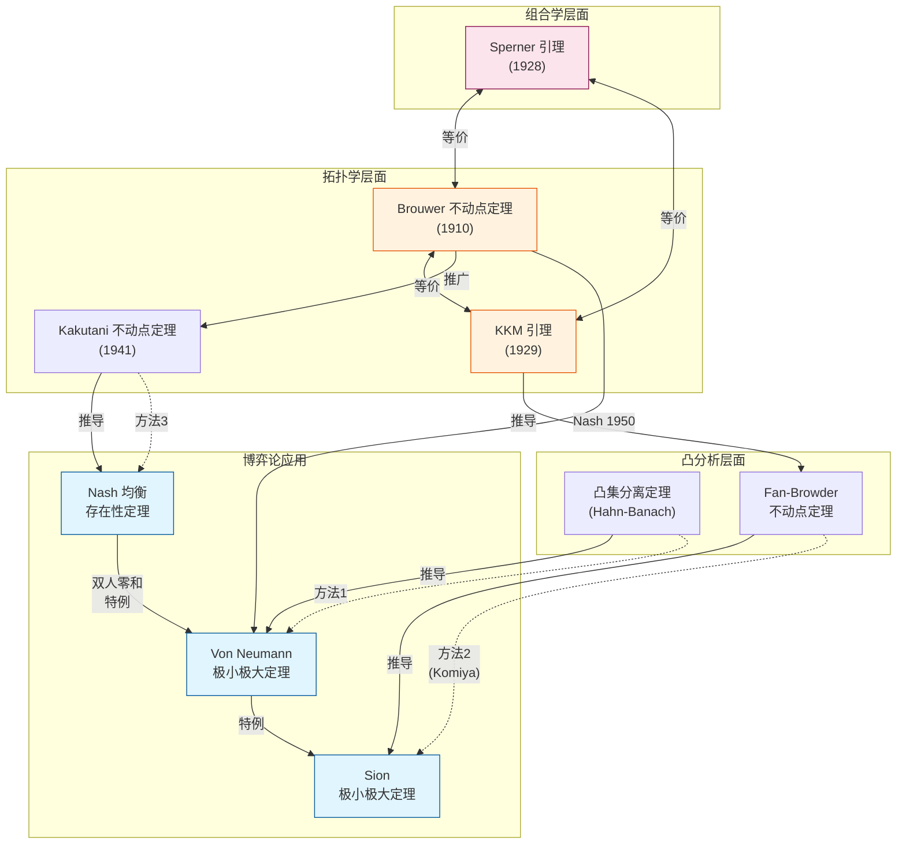
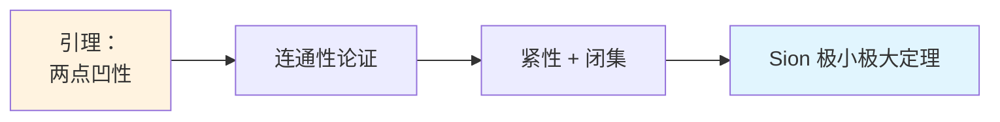
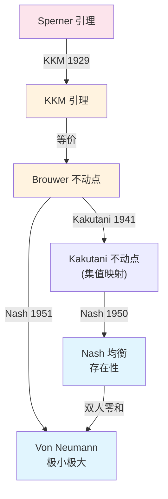
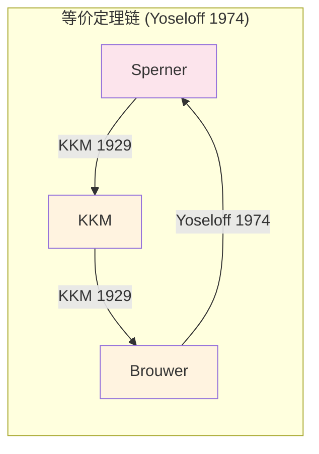

# Von Neumann 极小极大定理的三种证明方法及其关联

## 一、核心定理陈述

**Von Neumann 极小极大定理 (1928)**：设 $X \subseteq \mathbb{R}^m$, $Y \subseteq \mathbb{R}^n$ 为非空紧凸集，$f: X \times Y \to \mathbb{R}$ 是关于 $x$ 凹、关于 $y$ 凸的连续函数，则：
$$\max_{x \in X} \min_{y \in Y} f(x,y) = \min_{y \in Y} \max_{x \in X} f(x,y)$$

**Sion 推广 (1958)**：将条件放宽为拟凹-拟凸 (quasi-concave-convex) 及上下半连续性。

---

## 二、三种证明方法概览

### 方法 1: 凸分析方法 (Convex Analysis)
- **核心工具**：凸集分离定理 (Separation Theorem)
- **主要参考**：Ekeland & Témam [14]
- **特点**：基于对偶理论和超平面分离

### 方法 2: Komiya 初等方法 (Elementary Proof)
- **核心工具**：连通性论证 + 紧性
- **主要参考**：Komiya [25]
- **特点**：避开拓扑不动点定理，直接使用分析技巧

### 方法 3: 不动点方法 (Fixed Point)
- **核心工具**：Brouwer-Kakutani 不动点定理
- **主要参考**：Nash 证明，Sion [36]
- **特点**：可推广到 Nash 均衡存在性

---

## 三、定理等价关系图

---

## 四、详细证明路径

### 路径 A: 凸分析方法 (Ekeland-Témam)

**关键步骤**：
1. 利用 Hahn-Banach 定理分离凸集
2. 构造 Lagrangian 函数
3. 证明强对偶性 (strong duality)
4. 得到 min-max = max-min

**参考文献**：
- [14] Ekeland, I. & Témam, R. *Convex Analysis and Variational Problems*, SIAM, 1999. Chapter 6.

---

### 路径 B: Komiya 初等方法

**Komiya 证明核心**：
1. **引理1**：对任意 $y_1, y_2 \in Y$ 和 $\alpha < \min_{x} \max(f(x,y_1), f(x,y_2))$，存在 $y_0 \in [y_1, y_2]$ 使得 $\alpha < \min_x f(x, y_0)$
2. 通过反证法和闭集的有限覆盖性质
3. 不使用 Brouwer 或 KKM，纯分析方法

**参考文献**：
- [25] Komiya, H. "Elementary proof for Sion's minimax theorem", *Kodai Math. J.*, 11(1):5-7, 1988.

---

### 路径 C: 不动点方法 (Brouwer-Kakutani)

**Nash 证明步骤**：
1. 定义最优反应映射 $\phi: \Delta^{m-1} \times \Delta^{n-1} \to \Delta^{m-1} \times \Delta^{n-1}$
2. 验证 $\phi$ 满足 Brouwer/Kakutani 条件
3. 不动点即为均衡点
4. 对双人零和博弈，均衡条件等价于极小极大

---

## 五、KKM 与 Brouwer 的等价性详解

你提到知道 KKM 和 Brouwer 是等价的，这里是详细关系：

### KKM 引理
设 $\Delta_n = \text{conv}\{v_0, \ldots, v_n\}$ 为 $n$-单纯形，$C_0, \ldots, C_n$ 为闭集满足：
$$\text{conv}\{v_{i_0}, \ldots, v_{i_k}\} \subseteq C_{i_0} \cup \cdots \cup C_{i_k}$$
则 $\bigcap_{i=0}^n C_i \neq \emptyset$。

### 等价性证明要点
1. **Sperner → KKM**：对细分着色，取闭包极限
2. **KKM → Brouwer**：构造覆盖集 $C_i = \{x: x_i \geq f(x)_i\}$
3. **Brouwer → Sperner**：Yoseloff (1974) 的关键贡献

---

## 六、文献总结

### 核心参考文献

| 编号 | 作者 | 标题 | 方法 |
|------|------|------|------|
| [14] | Ekeland & Témam | *Convex Analysis and Variational Problems* | 凸分析 |
| [25] | Komiya (1988) | "Elementary proof for Sion's minimax theorem" | 初等方法 |
| [36] | Sion (1958) | "On general minimax theorems" | KKM + Helly |

### 补充文献

| 作者/年份 | 贡献 |
|-----------|------|
| Knaster-Kuratowski-Mazurkiewicz (1929) | KKM 引理，证明 Sperner → KKM → Brouwer |
| Nash (1950, 1951) | 用 Kakutani/Brouwer 证明均衡存在性 |
| Yoseloff (1974) | 完成等价链：Brouwer → Sperner |
| Fan (1964) | "Sur un théorème minimax"，Fan-Browder 定理 |
| Granas & Dugundji (2003) | *Fixed Point Theory*，综合参考 |

### 推荐阅读顺序

1. **理解等价性**：Border, K.C. *Fixed Point Theorems with Applications to Economics and Game Theory* (1985)
2. **Komiya 方法细节**：原文 [25] 仅 3 页，非常精炼
3. **凸分析背景**：[14] Chapter 6 "Duality by the minimax theorem"
4. **综合视角**：Granas & Dugundji [固定点理论] Chapter II.7

---

## 七、建议呈现结构

对于你的 Project 1 报告，建议按以下结构：

1. **引言**：极小极大定理的历史背景与重要性
2. **定理陈述**：Von Neumann (1928) → Sion (1958) 的推广
3. **三种方法**：
   - 3.1 凸分析方法 (概述)
   - 3.2 **Komiya 方法 (详细证明)** ← 重点
   - 3.3 不动点方法 → Nash 均衡
4. **等价性讨论**：KKM ⟺ Brouwer ⟺ Sperner
5. **参考文献**
