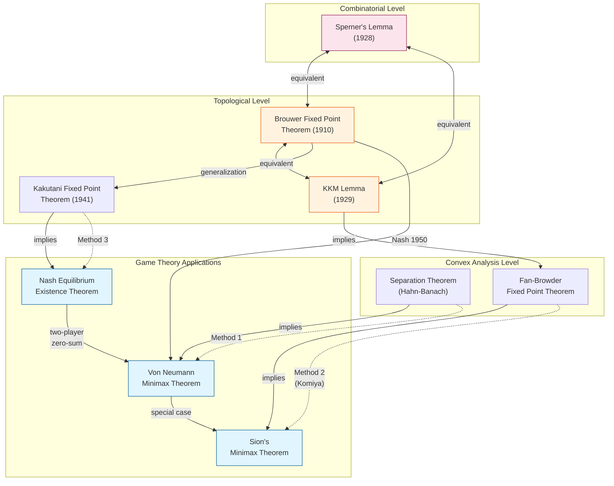
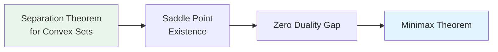
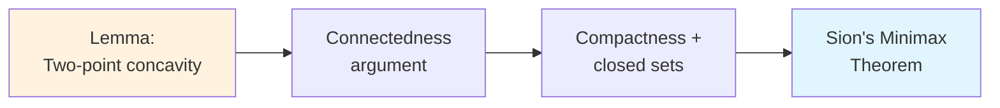
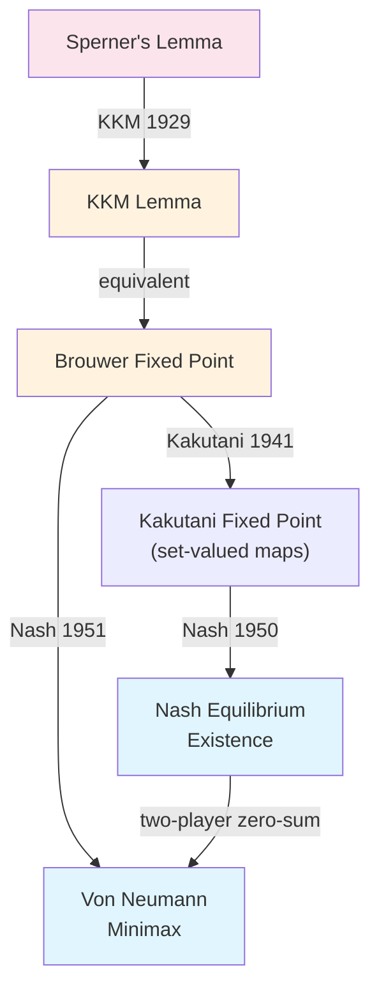
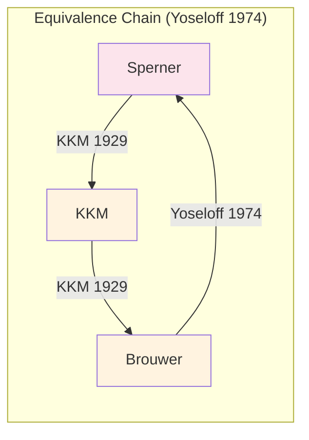

# Three Proof Methods for the Von Neumann Minimax Theorem and Their Connections

## I. Core Theorem Statement

**Von Neumann Minimax Theorem (1928)**: Let $X \subseteq \mathbb{R}^m$, $Y \subseteq \mathbb{R}^n$ be nonempty compact convex sets, and let $f: X \times Y \to \mathbb{R}$ be a continuous function that is concave in $x$ and convex in $y$. Then:
$$\max_{x \in X} \min_{y \in Y} f(x,y) = \min_{y \in Y} \max_{x \in X} f(x,y)$$

**Sion's Generalization (1958)**: The conditions are relaxed to quasi-concave-convex functions with upper/lower semicontinuity.

---

## II. Overview of Three Proof Methods

### Method 1: Convex Analysis Approach
- **Core Tools**: Separation Theorem for Convex Sets
- **Main Reference**: Ekeland & Témam [14]
- **Features**: Based on duality theory and hyperplane separation

### Method 2: Komiya's Elementary Approach
- **Core Tools**: Connectedness arguments + Compactness
- **Main Reference**: Komiya [25]
- **Features**: Avoids topological fixed point theorems, uses pure analytical techniques

### Method 3: Fixed Point Approach
- **Core Tools**: Brouwer-Kakutani Fixed Point Theorem
- **Main Reference**: Nash's proof, Sion [36]
- **Features**: Can be extended to prove Nash equilibrium existence

---

## III. Theorem Equivalence Diagram

---

## IV. Detailed Proof Paths

### Path A: Convex Analysis Approach (Ekeland-Témam)

**Key Steps**:
1. Apply the Hahn-Banach theorem to separate convex sets
2. Construct the Lagrangian function
3. Prove strong duality
4. Obtain min-max = max-min

**Reference**:
- [14] Ekeland, I. & Témam, R. *Convex Analysis and Variational Problems*, SIAM, 1999. Chapter 6.

---

### Path B: Komiya's Elementary Approach

**Core of Komiya's Proof**:
1. **Lemma 1**: For any $y_1, y_2 \in Y$ and any $\alpha < \min_{x} \max(f(x,y_1), f(x,y_2))$, there exists $y_0 \in [y_1, y_2]$ such that $\alpha < \min_x f(x, y_0)$
2. Proof by contradiction using finite covering properties of closed sets
3. Does not use Brouwer or KKM — purely analytical method

**Reference**:
- [25] Komiya, H. "Elementary proof for Sion's minimax theorem", *Kodai Math. J.*, 11(1):5-7, 1988.

---

### Path C: Fixed Point Approach (Brouwer-Kakutani)

**Nash's Proof Steps**:
1. Define the best response mapping $\phi: \Delta^{m-1} \times \Delta^{n-1} \to \Delta^{m-1} \times \Delta^{n-1}$
2. Verify that $\phi$ satisfies Brouwer/Kakutani conditions
3. A fixed point is an equilibrium point
4. For two-player zero-sum games, equilibrium conditions are equivalent to minimax

---

## V. Equivalence of KKM and Brouwer — Detailed Analysis

As you mentioned, KKM and Brouwer are equivalent. Here is the detailed relationship:

### KKM Lemma
Let $\Delta_n = \text{conv}\{v_0, \ldots, v_n\}$ be an $n$-simplex, and let $C_0, \ldots, C_n$ be closed sets satisfying:
$$\text{conv}\{v_{i_0}, \ldots, v_{i_k}\} \subseteq C_{i_0} \cup \cdots \cup C_{i_k}$$
Then $\bigcap_{i=0}^n C_i \neq \emptyset$.

### Key Points of Equivalence Proofs
1. **Sperner → KKM**: Take limits of closures over subdivisions
2. **KKM → Brouwer**: Construct covering sets $C_i = \{x: x_i \geq f(x)_i\}$
3. **Brouwer → Sperner**: Yoseloff (1974) completed this key contribution

---

## VI. Literature Summary

### Core References

| No. | Author | Title | Method |
|-----|--------|-------|--------|
| [14] | Ekeland & Témam | *Convex Analysis and Variational Problems* | Convex Analysis |
| [25] | Komiya (1988) | "Elementary proof for Sion's minimax theorem" | Elementary |
| [36] | Sion (1958) | "On general minimax theorems" | KKM + Helly |

### Supplementary References

| Author/Year | Contribution |
|-------------|--------------|
| Knaster-Kuratowski-Mazurkiewicz (1929) | KKM Lemma; proved Sperner → KKM → Brouwer |
| Nash (1950, 1951) | Used Kakutani/Brouwer to prove equilibrium existence |
| Yoseloff (1974) | Completed the equivalence chain: Brouwer → Sperner |
| Fan (1964) | "Sur un théorème minimax"; Fan-Browder theorem |
| Granas & Dugundji (2003) | *Fixed Point Theory*; comprehensive reference |

### Recommended Reading Order

1. **Understanding equivalences**: Border, K.C. *Fixed Point Theorems with Applications to Economics and Game Theory* (1985)
2. **Komiya's method details**: Original paper [25] is only 3 pages, very concise
3. **Convex analysis background**: [14] Chapter 6 "Duality by the minimax theorem"
4. **Comprehensive perspective**: Granas & Dugundji [Fixed Point Theory] Chapter II.7

---

## VII. Suggested Presentation Structure

For your Project 1 report, the recommended structure is:

1. **Introduction**: Historical background and importance of the minimax theorem
2. **Theorem Statement**: Von Neumann (1928) → Sion's generalization (1958)
3. **Three Methods**:
   - 3.1 Convex Analysis Approach (overview)
   - 3.2 **Komiya's Method (detailed proof)** ← Focus here
   - 3.3 Fixed Point Approach → Nash Equilibrium
4. **Equivalence Discussion**: KKM ⟺ Brouwer ⟺ Sperner
5. **References**
